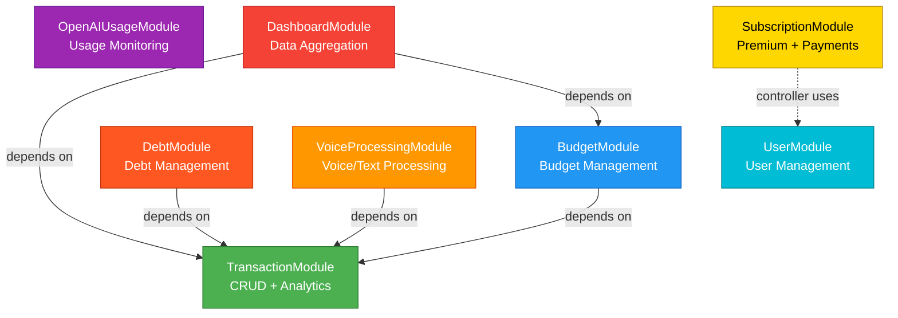

# Module System

Система организована в 8 самодостаточных модулей, каждый с четко определенной ответственностью.

## Module Dependencies



## Module Overview

| Модуль | Роль | Зависимости | Ключевые файлы |
|--------|------|-------------|----------------|
| **TransactionModule** | Core: транзакции и аналитика | Независимый | `transactionModule.ts` |
| **BudgetModule** | Управление бюджетами | TransactionModule | `budgetModule.ts` |
| **DebtModule** | Управление долгами | TransactionModule | `debtModule.ts` |
| **VoiceProcessingModule** | AI обработка голоса/текста | TransactionModule | `voiceProcessingModule.ts` |
| **OpenAIUsageModule** | Мониторинг OpenAI costs | Независимый | `openAIUsageModule.ts` |
| **DashboardModule** | Агрегация insights | Transaction + Budget | `dashboardModule.ts` |
| **SubscriptionModule** | Premium подписки + Telegram Stars | UserModule (controller) | `subscriptionModule.ts` |
| **UserModule** | Управление пользователями | Независимый | `userModule.ts` |

---

## 1. TransactionModule

**Файл:** [`src/modules/transaction/transactionModule.ts`](../../../src/modules/transaction/transactionModule.ts)

### Назначение
Core module системы — управление финансовыми транзакциями и аналитикой.

### Use Cases
- `CreateTransactionUseCase` - создание транзакции
- `GetTransactionsUseCase` - получение всех транзакций
- `GetUserTransactionsUseCase` - транзакции пользователя
- `UpdateTransactionUseCase` - обновление транзакции
- `DeleteTransactionUseCase` - удаление транзакции
- `UpdateTransactionWithLearningUseCase` - обновление с ML записью

### Services
- `AnalyticsService` - аналитика (summary, categories, trends, patterns)

### Repository
- Interface: `src/modules/transaction/domain/transactionRepository.ts`
- Implementations:
  - `SqliteTransactionRepository`
  - `SupabaseTransactionRepository`

### Module Creation
```typescript
const transactionModule = TransactionModule.create();
// Внутри: RepositoryFactory.createTransactionRepository()
```

---

## 2. BudgetModule

**Файл:** [`src/modules/budget/budgetModule.ts`](../../../src/modules/budget/budgetModule.ts)

### Назначение
Управление бюджетами с автоматическим расчетом потраченной суммы.

### Use Cases
- `CreateBudgetUseCase` - создание бюджета
- `GetBudgetsUseCase` - получение бюджетов пользователя
- `UpdateBudgetUseCase` - обновление бюджета
- `DeleteBudgetUseCase` - удаление бюджета

### Services
- `BudgetService` - расчет spent, budget summaries, alerts

### Key Dependency
```typescript
new BudgetService(
  budgetRepository,
  transactionModule.getRepository() // Нужен для расчета spent
)
```

**Почему зависимость?**
Для расчета `spent` нужно суммировать транзакции пользователя в периоде бюджета через `transactionRepository.getByUserIdAndDateRange()`.

---

## 3. DebtModule

**Файл:** [`src/modules/debt/debtModule.ts`](../../../src/modules/debt/debtModule.ts)

### Назначение
Управление долгами (кто кому должен) с историей погашений.

### Use Cases
- `CreateDebtUseCase` - создание долга (+ опциональная транзакция)
- `GetDebtsUseCase` - получение долгов пользователя, summary
- `UpdateDebtUseCase` - обновление и отмена долга
- `DeleteDebtUseCase` - удаление долга
- `PayDebtUseCase` - частичное/полное погашение долга

### Entities
- `Debt` - долг с типом (i_owe / owed_to_me), суммой, статусом
- `DebtPayment` - запись о платеже по долгу

### Key Dependency
```typescript
new CreateDebtUseCase(
  debtRepository,
  transactionModule.getCreateTransactionUseCase() // Для создания linked транзакции
)
```

**Почему зависимость?**
При создании долга с флагом `moneyTransferred=true` создается связанная транзакция (income/expense) для отражения реального движения денег.

### Hybrid Approach
- Долги как отдельная сущность (не транзакции)
- При передаче денег создается linked транзакция
- Баланс отражает реальность
- Долги не загрязняют бюджетную аналитику

---

## 4. SubscriptionModule

**Файл:** [`src/modules/subscription/subscriptionModule.ts`](../../../src/modules/subscription/subscriptionModule.ts)

### Назначение
Freemium модель с Telegram Stars: лимиты для free tier, безлимит для premium.

### Tier System

| Tier | Транзакции | Голосовые | Долги | Аналитика |
|------|------------|-----------|-------|-----------|
| **Free** | 50/месяц | 10/месяц | 5 активных | Скрыта |
| **Premium** | ∞ | ∞ | ∞ | Полная |

### Subscription Sources
- `payment` - оплата через Telegram Stars (100 Stars/месяц)
- `trial` - 14-дневный пробный период
- `gift` - подарок от админа (на определенный период)
- `lifetime` - пожизненный доступ

### Use Cases
- `CreateSubscriptionUseCase` - создание подписки после оплаты
- `GetSubscriptionUseCase` - получение статуса подписки с лимитами
- `CheckLimitUseCase` - проверка лимита перед действием
- `IncrementUsageUseCase` - увеличение счетчика после действия
- `GrantPremiumUseCase` - выдача premium админом
- `StartTrialUseCase` - запуск trial для нового пользователя
- `CancelSubscriptionUseCase` - отмена подписки

### Services
- `SubscriptionService` - проверка premium статуса, обработка истекших подписок

### Entities
- `Subscription` - подписка с tier, source, status, payment info
- `UsageLimit` - счетчики использования для free tier

### Repository
- Interface: `subscriptionRepository.ts`, `usageLimitRepository.ts`
- Implementations: SQLite + Supabase

### Key Dependency (Controller Layer)
```typescript
// SubscriptionController получает UserModule для резолва telegram_id → UUID
new SubscriptionController(subscriptionModule, userModule)
```

**Почему зависимость?**
API принимает telegram_id (например, `131184740`), но БД использует UUID. Controller резолвит ID через `GetOrCreateUserUseCase`.

### User ID Resolution

Controller обрабатывает 3 типа user ID:

| ID Type | Пример | Обработка |
|---------|--------|-----------|
| **Guest** | `guest_abc123-...` | Default free tier (без обращения к БД) |
| **Telegram ID** | `131184740` | Резолв через UserModule → UUID |
| **UUID** | `6c7c7a0e-...` | Прямой запрос к БД |

```typescript
// В SubscriptionController
if (this.isGuestUser(userId)) {
  return this.createGuestUserResponse(userId); // Free tier по умолчанию
}
const userUUID = await this.resolveUserId(userId); // telegram_id → UUID
```

### Telegram Stars Integration
```typescript
// Отправка invoice
await telegram.sendInvoice(chatId, {
  title: 'Premium',
  payload: JSON.stringify({ userId, type: 'premium' }),
  provider_token: '', // ПУСТАЯ СТРОКА для Stars!
  currency: 'XTR',
  prices: [{ label: 'Premium', amount: 100 }],
});

// КРИТИЧНО: ответить в течение 10 сек!
bot.on('pre_checkout_query', async (ctx) => {
  await ctx.answerPreCheckoutQuery(true);
});
```

### Middleware
- Express: `checkLimit`, `incrementUsage`, `requirePremium`
- Telegram: `createTelegramCheckLimitMiddleware`, `createTelegramIncrementUsageMiddleware`

---

## 5. VoiceProcessingModule

**Файл:** [`src/modules/voiceProcessing/voiceProcessingModule.ts`](../../../src/modules/voiceProcessing/voiceProcessingModule.ts)

### Назначение
AI-powered обработка голосовых сообщений и текстового ввода в транзакции.

### Use Cases
- `ProcessVoiceInputUseCase` - OGG → MP3 → Whisper → GPT → Transaction
- `ProcessTextInputUseCase` - Text → GPT → Transaction

### Services
- `OpenAITranscriptionService` - Whisper transcription + GPT parsing

### Key Dependency
```typescript
new ProcessVoiceInputUseCase(
  transcriptionService,
  transactionModule.getCreateTransactionUseCase() // Создание транзакции
)
```

**Почему зависимость?**
После парсинга транзакции из голоса/текста, нужно сохранить её через `CreateTransactionUseCase`.

---

## 6. OpenAIUsageModule

**Файл:** [`src/modules/openai-usage/openAIUsageModule.ts`](../../../src/modules/openai-usage/openAIUsageModule.ts)

### Назначение
Мониторинг использования и стоимости OpenAI API.

### Use Cases
- `GetOpenAIUsageUseCase` - получение usage data, billing limits, credit balance

### Repository
- `OpenAIUsageRepositoryImpl` - прямые API calls к OpenAI

### Features
- In-memory кеширование (5 минут)
- Расчет процента использования лимитов
- Алерты при приближении к лимиту

---

## 7. DashboardModule

**Файл:** [`src/modules/dashboard/dashboardModule.ts`](../../../src/modules/dashboard/dashboardModule.ts)

### Назначение
Агрегация данных из множества источников для dashboard view.

### Services
- `DashboardService` - полная dashboard сводка
  - Financial summary (из AnalyticsService)
  - Budget overview (из BudgetService)
  - Insights (savings rate, trends, рекомендации)
  - Financial Health Score (0-100)

### Key Dependencies
```typescript
new DashboardService(
  transactionModule.getAnalyticsService(),
  budgetModule.getBudgetService()
)
```

**Особенность:** Нет собственных use cases, только service для агрегации.

---

## Module Creation в appModules.ts

**Файл:** [`src/appModules.ts`](../../../src/appModules.ts)

```typescript
export function createModules() {
  // 1. Независимые модули
  const transactionModule = TransactionModule.create();
  const openAIUsageModule = createOpenAIUsageModule();
  const userModule = UserModule.create();

  // 2. Модули с зависимостями
  const budgetModule = BudgetModule.create(transactionModule);
  const debtModule = DebtModule.create(transactionModule);

  const openAIService = new OpenAITranscriptionService(AppConfig.OPENAI_API_KEY);
  const voiceModule = new VoiceProcessingModule(openAIService, transactionModule, debtModule);

  // 3. SubscriptionModule с repositories
  const subscriptionRepository = RepositoryFactory.createSubscriptionRepository();
  const usageLimitRepository = RepositoryFactory.createUsageLimitRepository();
  const subscriptionModule = new SubscriptionModule(subscriptionRepository, usageLimitRepository);

  return {
    transactionModule,
    budgetModule,
    debtModule,
    voiceModule,
    openAIUsageModule,
    userModule,
    subscriptionModule,
  };
}
```

**Порядок важен:**
1. Сначала создаются независимые модули
2. Затем модули с зависимостями, получая нужные модули как параметры

---

## Dependency Injection Pattern

### Constructor Injection

Каждый модуль получает зависимости через конструктор:

```typescript
class BudgetModule {
  constructor(private transactionModule: TransactionModule) {
    this.repository = RepositoryFactory.createBudgetRepository();
    this.budgetService = new BudgetService(
      this.repository,
      transactionModule.getRepository()
    );
  }
}
```

### Benefits
✅ **Explicit Dependencies** - видно, от чего зависит модуль
✅ **Testability** - легко мокировать зависимости в тестах
✅ **Flexibility** - можно передать любую реализацию
✅ **Compile-time Safety** - TypeScript проверяет типы

---

## Module Interface Pattern

Каждый модуль предоставляет getter-методы для доступа к use cases:

```typescript
class TransactionModule {
  getCreateTransactionUseCase() { return this.createTransactionUseCase; }
  getAnalyticsService() { return this.analyticsService; }
  getRepository() { return this.repository; }
}
```

**Почему не публичные свойства?**
- Инкапсуляция внутренней структуры
- Возможность добавить логику (например, lazy initialization)
- Явный API модуля

---

## Repository Factory

**Файл:** [`src/shared/infrastructure/database/repositoryFactory.ts`](../../../src/shared/infrastructure/database/repositoryFactory.ts)

```typescript
class RepositoryFactory {
  static createTransactionRepository(): TransactionRepository {
    return AppConfig.DATABASE_TYPE === 'supabase'
      ? new SupabaseTransactionRepository()
      : new SqliteTransactionRepository();
  }

  static createBudgetRepository(): BudgetRepository {
    return AppConfig.DATABASE_TYPE === 'supabase'
      ? new SupabaseBudgetRepository()
      : new SqliteBudgetRepository();
  }
}
```

**Преимущества:**
- Централизованный выбор реализации
- Легко добавить новую БД (например, MongoDB)
- Модули не зависят от конкретной БД

---

## См. также

- [Overview](overview.md) - Clean Architecture layers
- [Patterns](patterns.md) - Design patterns в проекте
- [Development Guide](../08-development/adding-features.md) - Как добавить новый модуль
