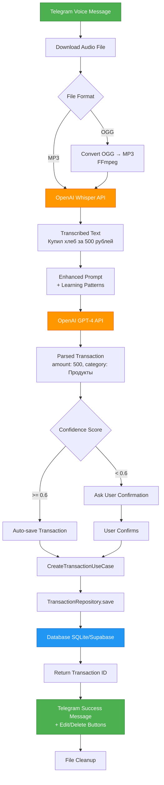

# Voice → Transaction Flow

Полный процесс преобразования голосового сообщения в транзакцию с использованием AI.

## Общий поток



## Детальные шаги

### 1. Получение голосового сообщения
**Handler:** Telegram Bot `bot.on('voice', ...)`

- Пользователь отправляет voice message в Telegram
- Telegram Bot получает voice file metadata
- File ID используется для скачивания

**Файл:** [`src/delivery/messaging/telegram/telegramBot.ts:140`](../../../src/delivery/messaging/telegram/telegramBot.ts)

---

### 2. Download Audio File
**Method:** `bot.telegram.getFileLink(fileId)`

- Primary: Сохранение в `DOWNLOADS_PATH` (настраиваемая директория)
- Fallback: OS temp directory (`os.tmpdir()`)
- Timeout: 30 секунд
- Error handling: Retry с alternative location

---

### 3. Audio Conversion (OGG → MP3)
**Method:** `ProcessVoiceInputUseCase.convertOggToMp3()`

**Primary Strategy - FFmpeg:**
```bash
ffmpeg -i input.ogg -acodec libmp3lame -ab 128k output.mp3
```

**Fallback Strategy:**
- Если FFmpeg недоступен: простое переименование файла
- Whisper API может обработать OGG, но MP3 надежнее

---

### 4. OpenAI Whisper Transcription
**Service:** `OpenAITranscriptionService.transcribe()`

**API Call:**
```typescript
const transcription = await openai.audio.transcriptions.create({
  file: fs.createReadStream(filePath),
  model: "whisper-1",
  language: "ru",
  response_format: "json"
});
```

**Output Example:**
```
"Купил хлеб в магазине Пятерочка за пятьсот рублей"
```

**Файл:** [`src/modules/voiceProcessing/infrastructure/openAITranscriptionService.ts:24`](../../../src/modules/voiceProcessing/infrastructure/openAITranscriptionService.ts)

---

### 5. Enhanced Prompt with Learning Patterns
**Service:** `TransactionLearningService.getEnhancedPrompts()`

**Система обучения:**
- Читает паттерны из `data/patterns.json`
- Добавляет learned category keywords
- Добавляет merchant aliases
- Улучшает точность парсинга на основе прошлых исправлений

**Enhanced Prompt Example:**
```
You are a financial assistant. Parse this text into transaction.
Today is 2026-01-09.

Learned patterns:
- "хлеб", "молоко" → category "Продукты"
- "Пятерочка", "5ка" → merchant "Пятёрочка"

Text: "Купил хлеб в магазине Пятерочка за пятьсот рублей"
```

---

### 6. OpenAI GPT-4 Transaction Parsing
**Service:** `OpenAITranscriptionService.analyzeTransactions()`

**API Call:**
```typescript
const response = await openai.chat.completions.create({
  model: "gpt-4-turbo",
  messages: [
    { role: "system", content: enhancedSystemPrompt },
    { role: "user", content: text }
  ],
  response_format: { type: "json_object" }
});
```

**Output Example:**
```json
{
  "transactions": [{
    "amount": 500,
    "type": "expense",
    "category": "Продукты",
    "description": "Хлеб",
    "merchant": "Пятёрочка",
    "date": "2026-01-09",
    "confidence": 0.85
  }]
}
```

---

### 7. Confidence Scoring

**Dynamic Confidence Calculation:**

```typescript
let confidence = 0.95; // Base confidence

// Снижение за отсутствующие поля
if (!merchant) confidence -= 0.1;
if (!category || category === 'Другое') confidence -= 0.15;
if (description.length < 3) confidence -= 0.05;

// Confidence range: 0.0 - 1.0
```

**Decision Logic:**
- **High confidence (≥ 0.6):** Автосохранение с опциями Edit/Delete
- **Low confidence (< 0.6):** Запрос подтверждения у пользователя

---

### 8. Transaction Creation
**Use Case:** `CreateTransactionUseCase.execute()`

**Steps:**
1. Валидация данных (amount > 0, valid date, etc.)
2. Enrichment (userId, timestamp)
3. Repository save
4. Возврат transaction ID

**Файл:** [`src/modules/transaction/application/createTransaction.ts`](../../../src/modules/transaction/application/createTransaction.ts)

---

### 9. Database Storage
**Repository:** `TransactionRepository.save()`

**SQLite:**
- TypeORM insert через `repository.save()`
- Auto-increment ID

**Supabase:**
- PostgreSQL insert через Supabase client
- UUID generation

**Stored Fields:**
```typescript
{
  id, amount, type, description, date,
  merchant, confidence,
  originalText: "Купил хлеб...",
  originalParsing: { /* GPT response */ },
  userId, createdAt, updatedAt
}
```

---

### 10. Telegram Response
**Handler:** Telegram Bot

**High Confidence Message:**
```
✅ Auto-saved: Купил хлеб в магазине...

💰 Amount: 500
📂 Category: Продукты
📊 Type: expense
🏪 Пятёрочка

[✏️ Edit] [🗑️ Delete]
[📊 Open app]
```

**Low Confidence Message:**
```
🤔 Please confirm:
📝 Купил хлеб...

💰 Amount: 500
📂 Category: Продукты
⚠️ Confidence: 45%

[✅ Confirm] [✏️ Edit] [❌ Delete]
```

---

### 11. File Cleanup
**Method:** `fs.unlinkSync()`

- Удаление original OGG file
- Удаление converted MP3 file
- Error handling для cleanup failures

---

## Error Handling

### Telegram Download Errors
- Retry с alternative directory
- Timeout после 30 секунд
- User-friendly message об ошибке

### OpenAI API Errors
- Rate limit handling
- Invalid API key detection
- Network timeout recovery

### FFmpeg Not Available
- Fallback на file rename
- Whisper может обработать OGG

### Parsing Failures
- Возврат пустого массива транзакций
- User notification о проблеме
- Logging для debugging

---

## Performance Considerations

**Bottlenecks:**
1. OpenAI API calls (2-5 seconds каждый)
2. File download (зависит от размера)
3. FFmpeg conversion (1-2 секунды)

**Optimizations:**
- Кеширование learned patterns
- Асинхронная обработка
- Parallel API calls (если несколько транзакций)

---

## Learning System Integration

**After User Correction:**

Если пользователь редактирует auto-saved транзакцию:

1. `UpdateTransactionWithLearningUseCase` вызывается
2. `TransactionLearningService.recordCorrection()` сохраняет:
   - Original parsing (что AI распознал)
   - User correction (что пользователь исправил)
   - Timestamp и userId
3. `updatePatterns()` обновляет `data/patterns.json`
4. Следующие парсинги используют улучшенные patterns

---

## Критичные файлы

- [`src/modules/voiceProcessing/application/processVoiceInput.ts`](../../../src/modules/voiceProcessing/application/processVoiceInput.ts) - Main use case
- [`src/modules/voiceProcessing/infrastructure/openAITranscriptionService.ts`](../../../src/modules/voiceProcessing/infrastructure/openAITranscriptionService.ts) - OpenAI integration
- [`src/delivery/messaging/telegram/telegramBot.ts`](../../../src/delivery/messaging/telegram/telegramBot.ts) - Telegram handlers
- [`src/shared/application/learning/transactionLearning.ts`](../../../src/shared/application/learning/transactionLearning.ts) - ML service

---

## См. также

- [API Lifecycle](api-lifecycle.md) - HTTP request flow
- [Architecture Overview](../01-architecture/overview.md) - Clean Architecture layers
- [Modules](../01-architecture/modules.md) - VoiceProcessingModule details
